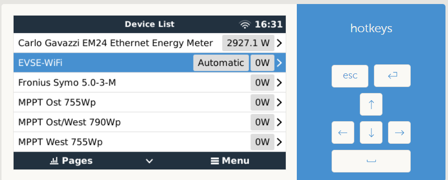
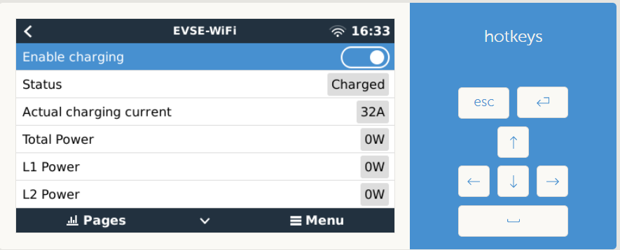
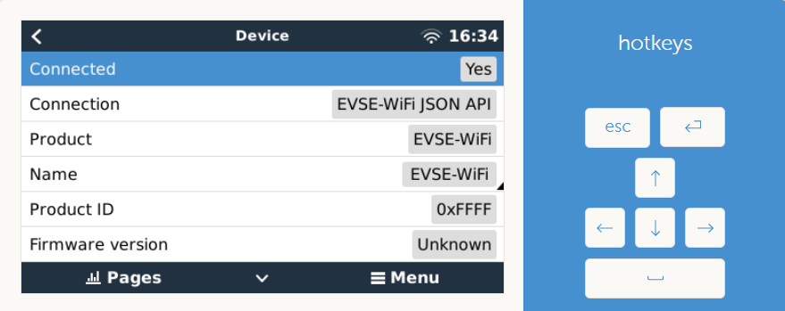

# dbus-evsewifi
Integrate EVSE-WiFi 2.0 (https://shop.evse-wifi.de/produkt/evse-wifi-2-0-base/) into Victron Energies Venus OS

## Purpose
This script supports reading EV charger values from EVSE-WiFi 2.0. Writing values is supported for "Enable charging"and  "Charging current", assumed that mode "Remote Controlled" is selected in EVSE-WiFi 2.0.

### Pictures
 




## Install & Configuration
### Get the code
Just grap a copy of the main branche and copy them to a folder under `/data/` e.g. `/data/dbus-evsewifi`.
After that call the install.sh script.

The following script should do everything for you:
```
wget https://github.com/Beme99/dbus-evsewifi/archive/refs/heads/main.zip
unzip main.zip "dbus-evsewifi-main/*" -d /data
mv /data/dbus-evsewifi-main /data/dbus-evsewifi
chmod a+x /data/dbus-evsewifi/install.sh
/data/dbus-evsewifi/install.sh
rm main.zip
```
⚠️ Check configuration after that - because service is already installed and running and with wrong connection data (host) you will spam the log-file

### Change config.ini
Within the project there is a file `/data/dbus-evsewifi/config.ini` - just change the values - most important is the deviceinstance under "DEFAULT" and host in section "ONPREMISE". More details below:

| Section  | Config valDankue | Explanation |
| ------------- | ------------- | ------------- |
| DEFAULT  | SignOfLifeLogMin  | Time in minutes how often a status is added to the log-file `current.log` with log-level INFO |
| DEFAULT  | Deviceinstance | Unique ID identifying the shelly 1pm in Venus OS |
| DEFAULT  | ACPosition | Position of EVSE-WiFi (0: AC-Output 1: AC-IN 2: AC-IN 2)
| DEFAULT  | Host | IP of EVSE-WiFi 2.0


## Usefull links
Many thanks. @JUWorkshop, @vikt0rm, @fabian-lauer and @trixing project:
- https://github.com/JuWorkshop/dbus-evsecharger
- https://github.com/trixing/venus.dbus-twc3
- https://github.com/fabian-lauer/dbus-shelly-3em-smartmeter
- https://github.com/vikt0rm/dbus-goecharger
